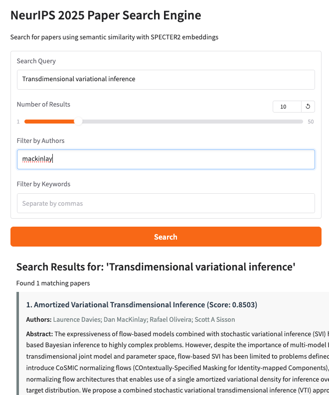

# NeurIPS 2025 Paper Search

A tool for extracting and semantically searching NeurIPS 2025 conference papers using SPECTER2 embeddings.

Indexes **5,275 accepted papers** from NeurIPS 2025 using the OpenReview API v2.
Runs a local web server on your laptop from which you can explore papers by topic.

**Developed by [Dan MacKinlay](https://danmackinlay.name) | [CSIRO](https://www.csiro.au/) (Commonwealth Scientific and Industrial Research Organisation)**




## Features

- Extract papers with full metadata from the OpenReview API
- Create semantic embeddings using SPECTER2 (specifically designed for academic papers)
- Build a robust search index with ChromaDB
- Search papers by semantic similarity, not just keywords
- Filter by authors and keywords
- Web interface for interactive searching
- Command-line interface for batch processing

## Installation / Quickstart

1. [Make sure uv is installed](https://github.com/astral-sh/uv)

2. Clone this repository:
   ```bash
   git clone https://github.com/danmackinlay/openreview-finder.git
   cd openreview-finder
   ```
3. Index the papers (~10 minutes, one-time setup)
   ```bash
   uv run openreview-finder index
   ```
4. Launch web interface
   ```bash
   uv run openreview-finder web
   ```

More options are available in the CLI help.

##  Examples

```bash
# Limit to top 5 results
uv run openreview-finder search "attention mechanism" --num-results 5

# Filter by author
uv run openreview-finder search "reinforcement learning" --author "Yoshua Bengio"

# Filter by keyword
uv run openreview-finder search "graph neural networks" --keyword "attention"

# Output in JSON format
uv run openreview-finder search "language models" --format json

# Save results to file
uv run openreview-finder search "diffusion models" --output results.csv
```

### Example Output

```bash
$ uv run openreview-finder search "diffusion models for image generation" -n 3

╒═════╤═════════════════════════════════════════════════════════════════════════════════════════╤══════════════════════════════════════════════════════════════════╤═════════╕
│   # │ Title                                                                                   │ Authors                                                          │   Score │
╞═════╪═════════════════════════════════════════════════════════════════════════════════════════╪══════════════════════════════════════════════════════════════════╪═════════╡
│   1 │ Hierarchical Koopman Diffusion: Fast Generation with Interpretable Diffusion Trajectory │ ['Hanru Bai', 'Weiyang Ding', 'Difan Zou']                       │  0.8953 │
├─────┼─────────────────────────────────────────────────────────────────────────────────────────┼──────────────────────────────────────────────────────────────────┼─────────┤
│   2 │ Composition and Alignment of Diffusion Models using Constrained Learning                │ ['Shervin Khalafi', 'Ignacio Hounie', 'Dongsheng Ding', 'et al'] │  0.8851 │
├─────┼─────────────────────────────────────────────────────────────────────────────────────────┼──────────────────────────────────────────────────────────────────┼─────────┤
│   3 │ DiCo: Revitalizing ConvNets for Scalable and Efficient Diffusion Modeling               │ ['Yuang Ai', 'Qihang Fan', 'Xuefeng Hu', 'et al']                │  0.8816 │
╘═════╧═════════════════════════════════════════════════════════════════════════════════════════╧══════════════════════════════════════════════════════════════════╧═════════╛```
```

## Technical Details

### NeurIPS 2025 Implementation

This tool uses the **OpenReview API v2**

- **Venue ID**: `NeurIPS.cc/2025/Conference`
- **Paper Selection**: Uses `get_all_notes(content={'venueid': venue_id})` to retrieve only accepted papers
- **Paper Count**: 5,275 accepted papers (poster, spotlight, and oral presentations)
- **Publication Status**: Automatically filters out submissions, withdrawn papers, and desk-rejected papers

Previous versions filtered based on invitation-based filtering, but this aligns better with OpenReview's current best practices.

### SPECTER2 Embeddings

This tool uses the [SPECTER2 model](https://huggingface.co/allenai/specter2) from the [Allen Institute for AI](https://allenai.org/), which is specifically designed for scientific papers. It creates embeddings that capture the semantic meaning of academic text better than general-purpose embedding models.

The first time you run the indexing command, it will download the SPECTER2 model (about 440MB).

### Data Storage

- Paper embeddings and search index are stored in `./chroma_db/neurips/`
- API cache is stored in `./api_cache/` to reduce API calls
- Logs are saved to `openreview_finder.log`
- Database size: ~107MB for 5,275 papers with embeddings

## Requirements

- Python 3.9+
- Dependencies include:

  - openreview-py
  - transformers/torch
  - chromadb
  - adapters
  - gradio

## Contributing

Contributions are welcome! Please feel free to submit a Pull Request.

## License

This project is licensed under the MIT License - see the LICENSE file for details.

## Acknowledgements

- [Allen Institute for AI](https://allenai.org/) for the SPECTER2 model
- [OpenReview](https://openreview.net/) for providing the API
- [CSIRO](https://www.csiro.au/) for supporting this work


